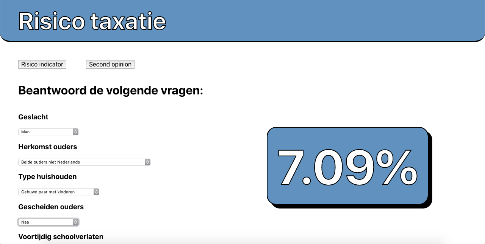
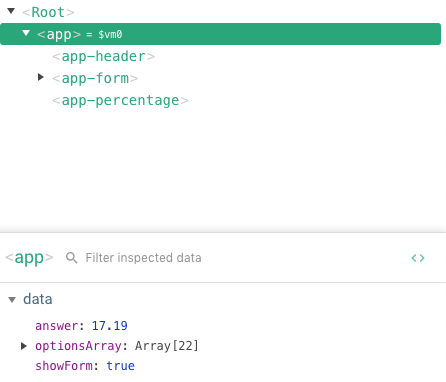

# Prototype risk indicator

> risk indicator



## Build Setup

The core program was build using the vue cli, with the vue create command

``` bash
# install dependencies
npm install

# serve with hot reload at localhost:8080
npm run dev

# build for production with minification
npm run build
```

## Dependencies

I used the following dependencies in my application

### Babel

Make sure my newer code runs in all browsers by refactoring it

### Uglify

Compress the code so it takes up less space and runs faster

### Browserify

So I can use requires and imports real time without having to build every time

### Vueify

In addition to browserify, for vue.js components

For more information see the [docs for vueify](https://github.com/vuejs/vueify).

### Watchify

Hot reload so I can see my changes everytime I save

## The idea

An application to determine the risk for a child to later be placed outside of parental custody. This could help people make a less subjective choice.

## Core functionality

#### Risk indication

Fill in the questions to get a risk indication, this live reloads every time a question is filled in. The weight of each choice is not correc yet but the functionality is there.

#### Second Opinion

Still in a conceptual phase. Upload your risk assesment for other people to view and rate, so you aren't alone in your decisions. This risk assesment would be completely anonymous as not to reveal the childs identity.

An addition to this would be a text field beneath every question where the person filling out the risk assesment can elaborate on the answer. This helps other professionals judge when giving their feedback.

## Project structure



Main component is app, main application logic happens here (calculating the percentage).

In the form component the questions.js file is imported. Form creates a input component for each question and passes it a question object.

In the input component the question object is used to dynamically display the right amount of options.

To calculate the total value of all the answers, each answer is linked to the question id and passed to an array in the app component which has as many empty spots as there are questions.

```javascript
optionsArray: new Array(questions.length)
```
```javascript
this.$data.optionsArray.splice(value[1], 1, value[0])
```
Here value[1] is the id of the question, which is used as the index to put the value into the array. value[0] is the actual value.

The sum of this array is then passed to the formula.
```javascript
this.$data.optionsArray.reduce((a, b) => a + b, 0)
```

After this the final answer is pushed to the percentage component to display it.

